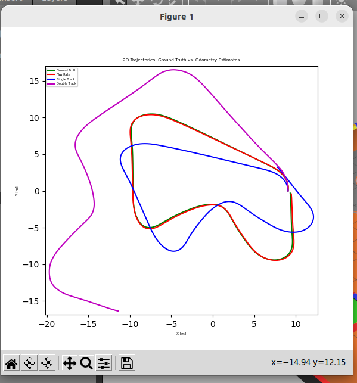

# Mobile-Robot-LAB-1

# Install Package
1. Create workspace and src folder and go in src folder
    ```bash
    cd
    mkdir -p MOBILE_ROBOT_WS/src && cd MOBILE_ROBOT_WS/src
    ```
2. git clone all package.
    ```bash
    git clone https://github.com/G4CiO/Mobile-Robot-LAB-1.git
    ```
3. build package
    ```bash
    cd ..
    colcon build
    ```
4. add source this package in .bashrc file.
    ```bash
    echo "source ~/MOBILE_ROBOT_WS/install/setup.bash" >> ~/.bashrc
    ```
5. source this package.
    ```bash
    source ~/.bashrc
    ```

# LAB 1.1 Kinematics of Mobile Robot
## Implementation
1. Spawn robot in gazebo and publish three model of odometry.

- Set to **Ackermann** Mode (Default):
    ```bash
    ros2 launch limo_bringup limo_bringup.launch.py steering_mode:=ackermann
    ```
- Set to **Bicycle** Mode:
    ```bash
    ros2 launch limo_bringup limo_bringup.launch.py steering_mode:=bicycle
    ```
2. Control robot by teleop_twist_keyboard in another terminal.
    ```
    ros2 run teleop_twist_keyboard teleop_twist_keyboard
    ```
## Varidation
1. Basic model VS Single Track

    - Pros

    - Cons

2. Basic model VS Double Track

    - Pros

    - Cons

3. Basic model VS Yaw rate

    - Pros

    - Cons

4. No-slip VS Single Track

    - Pros

    - Cons

5. No-slip VS Double Track

    - Pros

    - Cons

6. No-slip VS Yaw rate

    - Pros

    - Cons

# LAB 1.2 Path Tracking Controller
First *Spawn robot* by command from LAB 1.1 then
1. Run controller server
- Set to **Pure Pursuit** Mode (Default)
    ```bash
    ros2 run limo_controller controller_server.py --ros-args -p control_mode:=pure_pursuit
    ```
- Set to **PID** Mode
    ```
    ros2 run limo_controller controller_server.py --ros-args -p control_mode:=pid
    ```
- Set to **Stanley** Mode
    ```
    ros2 run limo_controller controller_server.py --ros-args -p control_mode:=stanley
    ```
- Clear path of robot
    ```bash
    ros2 service call /clear_path std_srvs/srv/Empty
    ```
# LAB 1.3 Extended kalman filter && Tuning Q and R 
## Meaning of Q and R
1. Q (Process Noise Covariance)
- Represents uncertainty or inaccuracies in the system model.
- Too-small Q value makes the filter overly trust the model, resulting in a lagged response when unexpected events occur.
- Too-large Q makes the filter rely more heavily on sensor measurements, potentially causing noisy estimates.
2. R (Measurement Noise Covariance):
- Represents sensor or measurement uncertainties.
- Too-small R value causes the filter to overly trust measurements, becoming vulnerable to noise.
- Too-large R makes the filter rely excessively on the model, slowing its response to real measurements.


## Sampling Data for Covarian calculation

run sampling node 
```bash
ros2 run limo_localization plot_odom.py
```
for stop sampling data 
```bash
ros2 topic pub --once /stop_collection std_msgs/Empty "{}"
```
## Images



stop dianosist
```bash
ros2 topic pub /stop_collection std_msgs/msg/Empty "{}" --once
```
