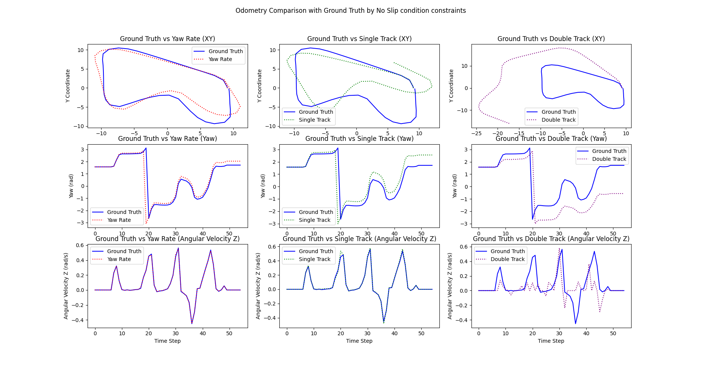
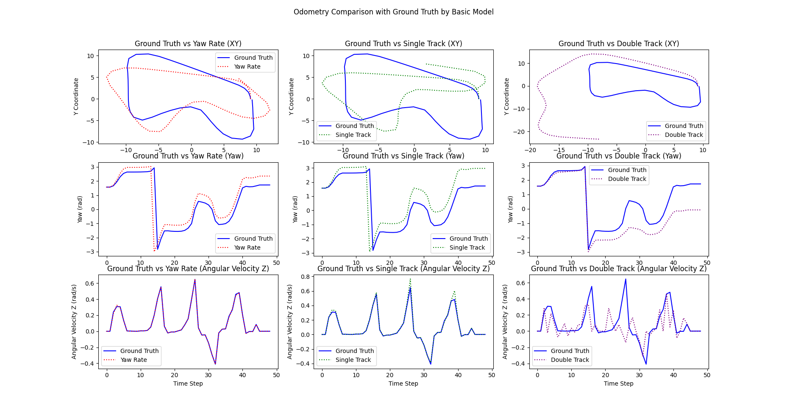
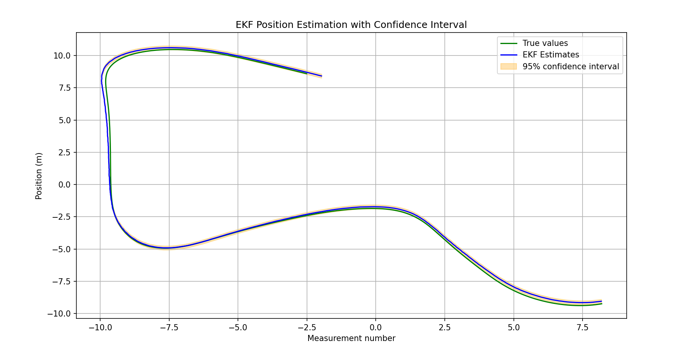
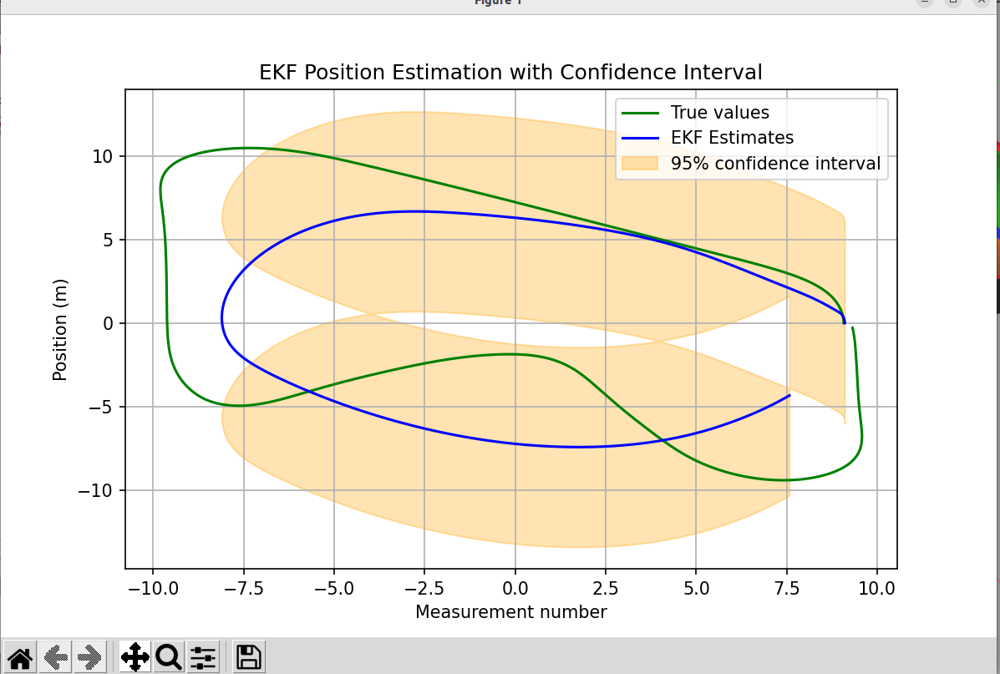
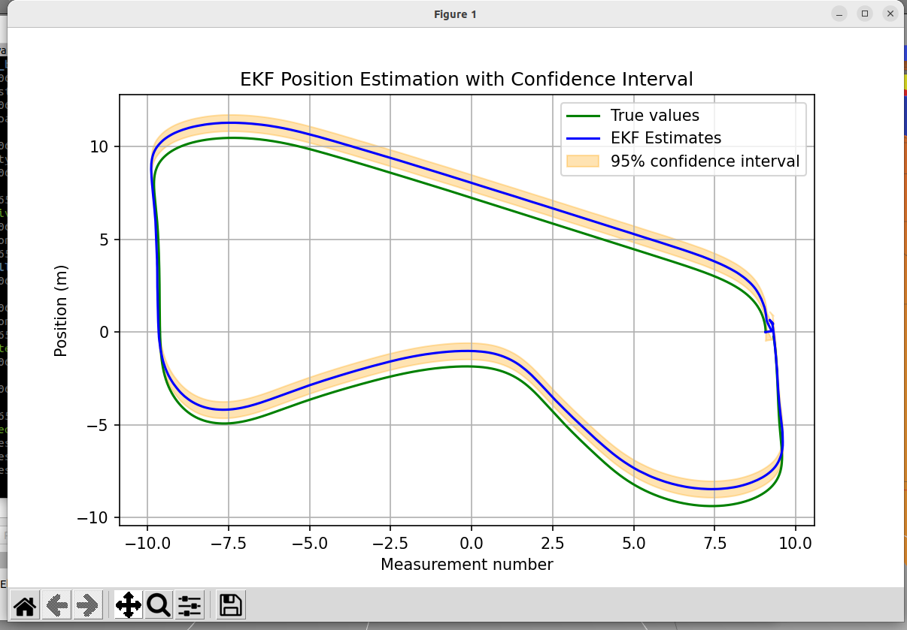
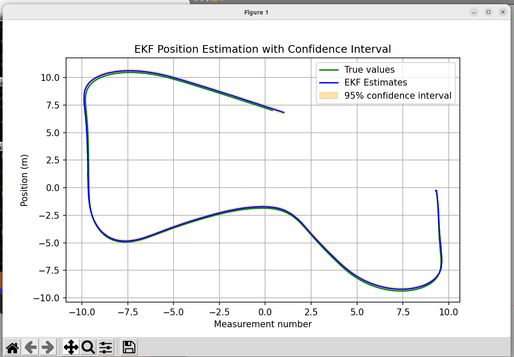
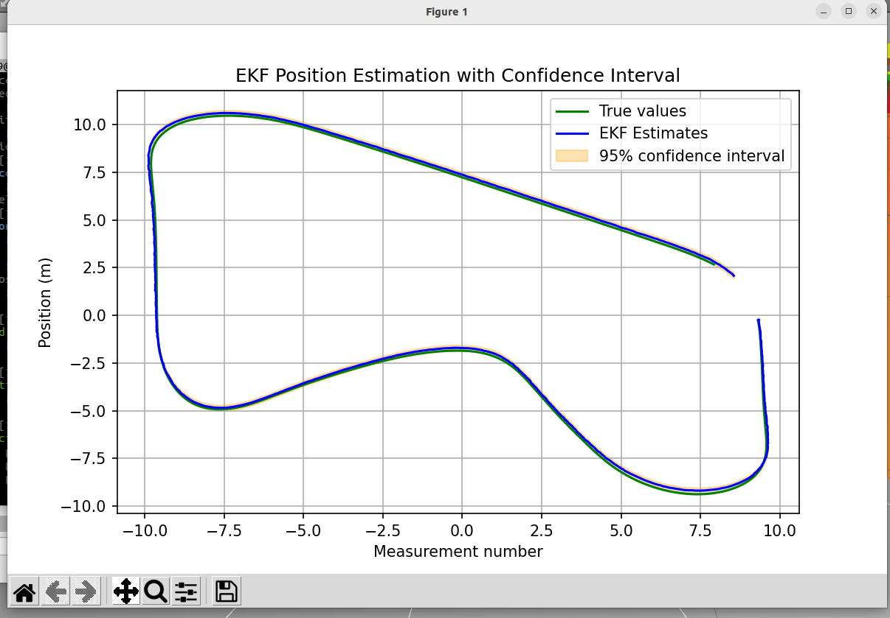

# Mobile-Robot-LAB-1

# Install Package
1. Create workspace and src folder and go in src folder
    ```bash
    cd
    mkdir -p MOBILE_ROBOT_WS/src && cd MOBILE_ROBOT_WS/src
    ```
2. git clone all package.
    ```bash
    git clone https://github.com/G4CiO/Mobile-Robot-LAB-1.git
    ```
3. build package
    ```bash
    cd ..
    colcon build
    ```
4. add source this package in .bashrc file.
    ```bash
    echo "source ~/MOBILE_ROBOT_WS/install/setup.bash" >> ~/.bashrc
    ```
5. source this package.
    ```bash
    source ~/.bashrc
    ```

# LAB 1.1 Kinematics of Mobile Robot
## Implementation
1. Spawn robot in gazebo and publish three model of odometry.

- Set to **Ackermann** Mode (Default):
    ```bash
    ros2 launch limo_bringup limo_bringup.launch.py steering_mode:=ackermann
    ```
- Set to **Bicycle** Mode:
    ```bash
    ros2 launch limo_bringup limo_bringup.launch.py steering_mode:=bicycle
    ```
2. Control robot by teleop_twist_keyboard in another terminal.
    ```
    ros2 run teleop_twist_keyboard teleop_twist_keyboard
    ```
## Varidation
### Result
### 1. No-slip

### 2. Basic model


### Comparison of results from graphs
**1.1 XY Trajectory**
- **No-Slip**: have path that similar to Ground Truth and less slip than the *Basic model* path.
- **Basic model**: More error-prone or slip, especially in path deviations, resulting in greater slip away from Ground Truth.
- **Yaw Rate Model**: is the most accurate because it takes into account the Ackermann steering principle and obtains the Yaw Rate value from the gyroscope sensor (IMU) for the rotation.
- **Single Track Model**: gives better results than Double Track Model but still has errors, especially in turning because the rotation is determined by the geometric orientation of the kinematic side-slip angles.
- **Double Track Model**: has the greatest error compared to Ground Truth because the rotation is calculated from the velocity-difference between the two rear wheels. Since the velocity of the two rear wheels is always the same, the change in rotation should always be 0. However, from the graph, there may be some spikes which may be from wheel slip causing the velocity of the two rear wheels to be different.

**1.2 Yaw**
- **No-Slip**: The yaw values ​​tend to be closer to Ground Truth, especially for *Yaw Rate Model*.
- **Basic model**: The yaw values has a greater slip from Ground Truth, as can be seen from the increased Yaw value compared to No-Slip. It because it have more slip when rotation.
- **Yaw Rate Model**: Most accurate and follows Ground Truth well.
- **Single Track Model**: Better performance but still has errors compared to Ground Truth.
- **Double Track Model**: has the most error, especially during fast rotations.

**1.3 Angular Velocity Z**
- **No-Slip**: It is closer to Ground Truth, especially the *Yaw Rate Model* and have some noise in *Single Track Model*
- **Basic model**: Same as *No-Slip* but in *Single Track Model* it has noise more than *No-Slip*.
- **Yaw Rate Model**: Highest accuracy, it can track along Angular Velocity Z of Ground Truth because it obtains the Yaw Rate value from the gyroscope sensor (IMU)
- **Single Track Model**:It's pretty close to Ground Truth, but it still has some errors.
- **Double Track Model**:Has the highest error and highest swing.

### Advantages and Disadvantages

#### 1. No-Slip
- **Advantages**
    - High accuracy, especially in trajectory tracking and yaw estimation.
    - Suitable for vehicles using Ackermann steering, such as cars.

- **Disadvantages**
    - More computationally intensive than the Basic Model.
    - Cannot model slip conditions.

#### 2. Basic Model
- **Advantages**
    - Faster and simpler to compute

- **Disadvantages**
    - Still has errors from slip, especially during sharp turns.
    - Cannot fully model Ackermann steering dynamics.

#### 3. Yaw Rate Model
- **Advantages**
    - Highest accuracy, especially in trajectory tracking and yaw from sensor IMU.
- **Disadvantages**
    - Requaied sensor IMU.
    - Still have error from wheel odometry.

#### 4. Single Track Model
- **Advantages**
    - Suitable for systems with Basic Model (Bicycle Model)
- **Disadvantages**
    - Still has errors, especially in sharp turns.

#### 5. Double Track  Model
- **Advantages**
    - Suitable for systems with Differential Velocity Model that rotation from differential velocity of two rear wheel.
- **Disadvantages**
    - Highest error, especially in XY trajectory for model Ackermann steering.

# LAB 1.2 Path Tracking Controller
First *Spawn robot* by command from LAB 1.1 then
1. Run controller server
- Set to **Pure Pursuit** Mode (Default)
    ```bash
    ros2 run limo_controller controller_server.py --ros-args -p control_mode:=pure_pursuit
    ```
- Set to **PID** Mode
    ```
    ros2 run limo_controller controller_server.py --ros-args -p control_mode:=pid
    ```
- Set to **Stanley** Mode
    ```
    ros2 run limo_controller controller_server.py --ros-args -p control_mode:=stanley
    ```
- Clear path of robot
    ```bash
    ros2 service call /clear_path std_srvs/srv/Empty
    ```
# LAB 1.3 Extended kalman filter && Tuning Q and R 
## Meaning of Q and R
1. Q (Process Noise Covariance)
- Represents uncertainty or inaccuracies in the system model.
- Too-small Q value makes the filter overly trust the model, resulting in a lagged response when unexpected events occur.
- Too-large Q makes the filter rely more heavily on sensor measurements, potentially causing noisy estimates.
2. R (Measurement Noise Covariance):
- Represents sensor or measurement uncertainties.
- Too-small R value causes the filter to overly trust measurements, becoming vulnerable to noise.
- Too-large R makes the filter rely excessively on the model, slowing its response to real measurements.


## Sampling Data for R_matrix 
We can determine the value of \( R \) by calculating the covariance of the difference between wheel odometry and ground truth. For the GPS node, we will set \( R \) to match the parameters configured in the GPS node.
 1. run sampling node for colelcting and export covariance of each wheel_odom topologies
```bash
ros2 run limo_localization plot_odom.py
```
2. then follow by controller (you can switch to other controller if you want)
```bash
ros2 run limo_controller controller_server.py --ros-args -p control_mode:=pure_pursuit
```
3. for stop sampling data after the robot finished lab
```bash
ros2 topic pub --once /stop_collection std_msgs/Empty "{}"
```
Below is the updated Markdown for your odometry document with larger brackets for the state vector. The key change is the use of `\left[ ... \right]` for automatically resized brackets in LaTeX. These bigger brackets should render nicely in Canva or GitHub.

```markdown
## What does "plot_odom node" do?

Each odometry message contains a **12-dimensional state vector**:

```math
X = \left[\begin{array}{c}
x \\
 y \\
 z \\
 \text{roll} \\
 \text{pitch} \\
 \text{yaw} \\
 v_x \\
 v_y \\
 v_z \\
 \omega_x \\
 \omega_y \\
 \omega_z
\end{array}\right]
```

where:
- $(x, y, z)$ are position coordinates.
- $(\text{roll}, \text{pitch}, \text{yaw})$ represent orientation (converted from quaternions).
- $(v_x, v_y, v_z)$ are linear velocity components.
- $(\omega_x, \omega_y, \omega_z)$ are angular velocity components.

The EKF requires a **covariance matrix** to model uncertainty in these state estimates.

---

## 3. Sample Mean Computation

Given a set of **N** state vectors $\{X_1, X_2, \dots, X_N\}$, the sample mean $\mu$ is computed as:

```math
\mu = \frac{1}{N} \sum_{i=1}^{N} X_i
```

where $\mu$ is the **mean state vector**, representing the average of all odometry estimates.

---

## 4. Covariance Matrix Computation

The covariance matrix $\Sigma$ quantifies the **spread and correlation** of the state estimates and is computed as:

```math
\Sigma = \frac{1}{N} \sum_{i=1}^{N} (X_i - \mu) (X_i - \mu)^T
```

Each element $\Sigma_{jk}$ in the **12×12 covariance matrix** represents the covariance between the $j$-th and $k$-th state variables:

```math
\Sigma_{jk} = \frac{1}{N} \sum_{i=1}^{N}\bigl(X_{i,j} - \mu_j\bigr)\bigl(X_{i,k} - \mu_k\bigr)
```

where:
- $X_{i,j}$ is the **j-th component** of the i-th state vector.
- $\mu_j$ is the mean of the **j-th state variable**.
- $\Sigma_{jk}$ captures how **state variable $j$ correlates with variable $k$**.

---

## 5. Computation Process

1. **Load recorded odometry data** from the CSV file.
2. **Extract ground truth and odometry estimates** for each state variable.
3. **Compute error** for each state variable:

   ```math
   \text{error}_j = X_{\text{odom},j} - X_{\text{gt},j}
   ```

   where $X_{\text{odom},j}$ is the odometry estimate and $X_{\text{gt},j}$ is the ground truth.

4. **Compute the covariance matrix** using the error vectors.
5. **Save covariance matrices** to a YAML file for EKF use.

---

## 6. YAML Output Format

The computed covariance matrices are stored in a **YAML file** for integration with the EKF node. Example format:

```yaml
covariances:
  yaw_rate:
    - [0.01, 0.002, ..., 0.0001]
    - [0.002, 0.015, ..., 0.0003]
    ...
  single_track:
    - [0.005, 0.001, ..., 0.0002]
    - [0.001, 0.007, ..., 0.0004]
    ...
  double_track:
    - [0.003, 0.002, ..., 0.0003]
    - [0.002, 0.012, ..., 0.0005]
    ...
```
```


After obtaining the value of 
𝑅, the next step is tuning the value of 
𝑄. In this process, we will use the trial-and-error method while observing the 95% confidence interval. The goal is to prevent the EKF from becoming overconfident or diverging from the true values.

## Overconfident estimator


### Assume No process noise
```
Q = np.diag([
    0.0, 0.0, 0.0,  # position noise
    0.0, 0.0, 0.0,  # orientation noise (rad)
    0.0, 0.0, 0.0,  # linear velocity noise
    0.0, 0.0, 0.0,  # angular velocity noise (rad/s)
    0.0, 0.0, 0.0   # linear acceleration noise
]) ** 2
```


```
Q = np.diag([
    0.01, 0.01, 0.01,  # position noise
    0.01, 0.01, 0.01,  # orientation noise (rad)
    0.01, 0.01, 0.01,  # linear velocity noise
    0.01, 0.01, 0.01,  # angular velocity noise (rad/s)
    0.01, 0.01, 0.01   # linear acceleration noise
]) ** 2
```


```
Q = np.diag([
    0.1, 0.1, 0.1,  # position noise
    0.1, 0.1, 0.1,  # orientation noise (rad)
    0.1, 0.1, 0.1,  # linear velocity noise
    0.1, 0.1, 0.1,  # angular velocity noise (rad/s)
    0.1, 0.1, 0.1   # linear acceleration noise
]) ** 2
```

```
Q = np.diag([
    1.0, 1.0, 1.0,  # position noise
    1.0, 1.0, 1.0,  # orientation noise (rad)
    1.0, 1.0, 1.0,  # linear velocity noise
    1.0, 1.0, 1.0,  # angular velocity noise (rad/s)
    1.0, 1.0, 1.0   # linear acceleration noise
]) ** 2
```

It can be observed that as we increase the value of  Q , the system tends to rely more on the measurements and becomes overly confident.

