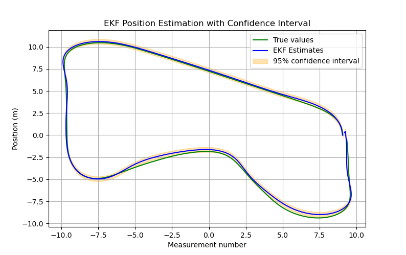

# Mobile-Robot-LAB-1
# Member
#### 1. Chayanin     Napia       No. 65340500009
#### 2. Natthaphat   Sookpanya   No. 65340500023


# Install Package
1. Create workspace and src folder and go in src folder
    ```bash
    cd
    mkdir -p MOBILE_ROBOT_WS/src && cd MOBILE_ROBOT_WS/src
    ```
2. git clone all package.
    ```bash
    git clone https://github.com/G4CiO/Mobile-Robot-LAB-1.git
    ```
3. build package
    ```bash
    cd ..
    colcon build
    ```
4. add source this package in .bashrc file.
    ```bash
    echo "source ~/MOBILE_ROBOT_WS/install/setup.bash" >> ~/.bashrc
    ```
5. source this package.
    ```bash
    source ~/.bashrc
    ```

# LAB 1.1 Kinematics of Mobile Robot
## Implementation
### How to use this Lab.
1. Spawn robot in gazebo and publish three model of odometry.

- Set to **Ackermann** Mode (Default):
    ```bash
    ros2 launch limo_bringup limo_bringup.launch.py steering_mode:=ackermann
    ```
- Set to **Bicycle** Mode:
    ```bash
    ros2 launch limo_bringup limo_bringup.launch.py steering_mode:=bicycle
    ```
2. Control robot by teleop_twist_keyboard in another terminal.
    ```
    ros2 run teleop_twist_keyboard teleop_twist_keyboard
    ```
### Model Ackermann Steering
1. Create package [limo_description](limo_description/) for write URDF of robot.
2. Create URDF of robot.
    #### Robot model
    

    I have two model. First, [limo_meshes.xacro](limo_description/urdf/limo_meshes.xacro) for include model of limo mobile robot. Second, [limo_no_meshes.xacro](limo_description/urdf/limo_no_meshes.xacro) for use normal geometry model. I create two ver. because when use model in URDF it make my computer lack. You can change model in launch file [limo.launch.py](limo_description/launch/limo.launch.py)

    #### Robot TF
    

    **Tree of TF**
    - base_footprint
        - base_link
            - imu_link
            - rear_left_wheel_link
            - rear_right_wheel_link
            - left_steering_hinge
                - front_left_wheel_link
            - right_steering_hinge
                - front_right_wheel_link
3. Import robot to Gazebo.

    I create package [limo_gazebo](limo_gazebo/) for load world in gazebo ([load_world_into_gazebo.launch.py](limo_gazebo/launch/load_world_into_gazebo.launch.py)), spawn robot in gazebo, and spawn controller for control robot ([sim.launch.py](limo_gazebo/launch/sim.launch.py)).

    
    

### Inverse Kinematics
1. Create node [steering_model_node.py](limo_controller/scripts/steering_model_node.py) for compute Inverse Kinematics that get **cmd_vel** and turn to **wheel speed** of robot.
    #### 1.1 Basic Model
    Find steer angle $\delta$ from


    
    $\delta = \arctan \left( \frac{L \Omega_z}{v} \right)$

    where:
    - $L$ is the wheelbase of the vehicle,
    - $\Omega_z$ is the angular velocity at z axis of the vehicle,
    - $v$ is the velocity of the vehicle.

    Can implement in code:
    ```python
    self.delta_steer = math.atan(wheelbase * self.omega / self.v) if self.v != 0 else 0
    ```
    #### 1.2 No Slip condition constraints
    The Ackermann steering angle is given by:

    $\delta_{Ack} = \frac{\delta_{in}}{\gamma}$

    The left and right wheel steering angles are calculated as:

    $\delta_L = \tan^{-1} \left( \frac{WB \tan(\delta_{Ack})}{WB + 0.5 TW \tan(\delta_{Ack})} \right)$

    $\delta_R = \tan^{-1} \left( \frac{WB \tan(\delta_{Ack})}{WB - 0.5 TW \tan(\delta_{Ack})} \right)$

    where:
    - $\delta_{Ack}$ is the Ackermann steering angle,
    - $\delta_{in}$ is the steering angle,
    - $\gamma$ is the steering ratio,
    - $WB$ is the wheelbase,
    - $TW$ is the track width.

    Can implement in code:
    ```python
    self.delta_steer = math.atan(wheelbase * self.omega / self.v) if self.v != 0 else 0
    delta_ack = self.delta_steer / steering_ratio

    delta_L = math.atan((wheelbase * math.tan(delta_ack)) / (wheelbase - 0.5 * track_width * math.tan(delta_ack)))
    delta_R = math.atan((wheelbase * math.tan(delta_ack)) / (wheelbase + 0.5 * track_width * math.tan(delta_ack)))
    ```
### Forward Kinematics
1. Create node [odometry_calculation.py](limo_controller/scripts/odometry_calculation.py) for compute Forward Kinematics from **wheel speed** to **odometry** by use 3 model.
    #### 1.1 Yaw rate
    The *Yaw-Rate-Odometry Model* (OdoYawRate) uses the yaw rate $\omega^x$ directly measured by the gyroscope sensor as the infor- mation for the rotation. 
    
    The model also uses the average rear wheel velocities as the information on the translation motion. For a vehicle without rear axle steering $\delta^x_R = 0 $, the state update equation is:

    
    $$\begin{pmatrix}
    x_k \\
    y_k \\
    \theta_k \\
    \beta_k \\
    v_k \\
    \omega_k^x
    \end{pmatrix}
    =
    \begin{pmatrix}
    x_{k-1} + v_{k-1} \cdot \Delta t \cdot \cos\left(\beta_{k-1} + \theta_{k-1} + \frac{\omega_{k-1} \cdot \Delta t}{2}\right) \\
    y_{k-1} + v_{k-1} \cdot \Delta t \cdot \sin\left(\beta_{k-1} + \theta_{k-1} + \frac{\omega_{k-1} \cdot \Delta t}{2}\right) \\
    \theta_{k-1} + \omega_{k-1} \cdot \Delta t \\
    0 \\
    \frac{\tilde{v}^x_{RL,k} + \tilde{v}^x_{RR,k}}{2} \\
    \omega_k^x
    \end{pmatrix}$$

   where:
    - $x_{k}, y_{k}$ is Position coordinates of vehicle,
    - $\theta_k$ is Angular Position in z axis of vehicle, 
    - $\beta_k$ is Slip angle of vehicle, 
    - $v_{k}$ is Linear Velocity of vehicle,
    - $\omega_k$ is Angular velocity of vehicle,
    - $\omega_k^x$ is yaw rate that directly measured by the gyroscope sensor, 
    - $\Delta t$ is Time step, 
    - $\tilde{v}^x_{RL,k}, \tilde{v}^x_{RR,k}$ is Rear Left/Right wheel velocities.

    Can implement in code:
    ```python
    def OdoYawRate(self):
    # Compute new pose        
    self.x_curr = self.x_curr + (self.v_curr * self.dt * math.cos(self.theta_curr + self.BETA + ((self.w_curr * self.dt) / 2)))
    self.y_curr = self.y_curr + (self.v_curr * self.dt * math.sin(self.theta_curr + self.BETA + ((self.w_curr * self.dt) / 2)))
    self.theta_curr = self.theta_curr + (self.w_curr * self.dt)
    self.quaternion = tf_transformations.quaternion_from_euler(0.0, 0.0, self.theta_curr)
    self.v_curr = self.v_avr
    self.w_curr = self.yaw_rate

    # Publish odometry message
    self.publish_odom("odom", "base_footprint", self.x_curr, self.y_curr, self.quaternion, self.v_curr, self.w_curr, self.yaw_rate_publisher)
    ```

    #### 1.2 Single-track model
    For the *Kinematic-Single-Track Model* (Odo1Track), the translation motion is determined by the average velocity of the rear wheels. The rotation is determined by the geometric orientation of the kinematic side-slip angles.

    and for a vehicle without rear axle steering $\beta_R = 0$ in:

    

   where:
    - $x_{k}, y_{k}$ is Position coordinates of vehicle,
    - $\theta_k$ is Angular Position in z axis of vehicle, 
    - $\beta_k$ is Slip angle of vehicle, 
    - $v_{k}$ is Linear Velocity of vehicle,
    - $\omega_k$ is Angular velocity of vehicle,
    - $\Delta t$ is Time step, 
    - $\tilde{v}^x_{RL,k}, \tilde{v}^x_{RR,k}$ is Rear Left/Right wheel velocities.
    - $r_b$ is Wheel base
    - $\beta^x_{F,k}$ is side-slip angles at between front wheel.

    Can implement in code:

    ```python
    def delta_steering(self, delta_L, delta_R, wheelbase, track_width, steering_ratio):
        delta_ack_L = math.atan((wheelbase * math.tan(delta_L)) / (wheelbase - 0.5 * track_width * math.tan(delta_L)))
        delta_ack_R = math.atan((wheelbase * math.tan(delta_R)) / (wheelbase + 0.5 * track_width * math.tan(delta_R)))
        delta_ack = (delta_ack_L + delta_ack_R) / 2
        delta_steer = delta_ack * steering_ratio
        return delta_steer

    def Odo1Track(self):
    # Compute new pose  
    delta_steer = self.delta_steering(self.delta_L, self.delta_R, self.wheelbase, self.track_width, self.steering_ratio)
    self.x_curr_1Track = self.x_curr_1Track + (self.v_curr_1Track * self.dt * math.cos(self.theta_curr_1Track + self.BETA + ((self.w_curr_1Track * self.dt) / 2)))
    self.y_curr_1Track = self.y_curr_1Track + (self.v_curr_1Track * self.dt * math.sin(self.theta_curr_1Track + self.BETA + ((self.w_curr_1Track * self.dt) / 2)))
    self.theta_curr_1Track = self.theta_curr_1Track + (self.w_curr_1Track * self.dt)
    self.quaternion_1Track = tf_transformations.quaternion_from_euler(0.0, 0.0, self.theta_curr_1Track)
    self.v_curr_1Track = self.v_avr
    self.w_curr_1Track = (self.v_curr_1Track / self.wheelbase) * math.tan(delta_steer)

    # Publish odometry message
    self.publish_odom("odom", "base_footprint", self.x_curr_1Track, self.y_curr_1Track, self.quaternion_1Track, self.v_curr_1Track, self.w_curr_1Track, self.single_track_publisher)
    ```

    #### 1.3 Double-track model
    The Kinematic-Double-Track Model determines the pose solely on the basis of two single wheel velocities. The translation motion is calculated by the average absolute value of the velocities of the two wheels. The rotation is determined on the basis of the velocity-difference with respect to the single wheel angles and the wheel contact points

    For a vehicle without rear axle steering $\delta^x_R = 0 ⇒ \delta_{RL},\delta_{RR} = 0$ the simplest form can be build: the *Kinematic-Double-Track Model* (Odo2Track) sometimes also called *Differential-Velocity Model*:

    

   where:
    - $x_{k}, y_{k}$ is Position coordinates of vehicle,
    - $\theta_k$ is Angular Position in z axis of vehicle, 
    - $\beta_k$ is Slip angle of vehicle, 
    - $v_{k}$ is Linear Velocity of vehicle,
    - $\omega_k$ is Angular velocity of vehicle,
    - $\Delta t$ is Time step, 
    - $\tilde{v}^x_{RL,k}, \tilde{v}^x_{RR,k}$ is Rear Left/Right wheel velocities,
    - $r_{RR,y} - r_{RL,y}$ is Track Width.

    Can implement in code:
    ```python
    def Odo2Track(self):
    # Compute new pose  
    self.x_curr_2Track = self.x_curr_2Track + (self.v_curr_2Track * self.dt * math.cos(self.theta_curr_2Track + self.BETA + ((self.w_curr_2Track * self.dt) / 2)))
    self.y_curr_2Track = self.y_curr_2Track + (self.v_curr_2Track * self.dt * math.sin(self.theta_curr_2Track + self.BETA + ((self.w_curr_2Track * self.dt) / 2)))
    self.theta_curr_2Track = self.theta_curr_2Track + (self.w_curr_2Track * self.dt)
    self.quaternion_2Track = tf_transformations.quaternion_from_euler(0.0, 0.0, self.theta_curr_2Track)
    self.v_curr_2Track = self.v_avr
    self.w_curr_2Track = (self.v_rr - self.v_rl) / self.track_width

    # Publish odometry message
    self.publish_odom("odom", "base_footprint", self.x_curr_2Track, self.y_curr_2Track, self.quaternion_2Track, self.v_curr_2Track, self.w_curr_2Track, self.double_track_publisher)
    ```

## Varidation
### Result
### 1. No-slip

### 2. Basic model


### Comparison of results from graphs
**1.1 XY Trajectory**
- **No-Slip**: have path that similar to Ground Truth and less slip than the *Basic model* path.
- **Basic model**: More error-prone or slip, especially effect to Yaw Rate and Double Track, resulting in greater slip away from Ground Truth especially when turn a curve.
- **Yaw Rate Model**: is the high accurate because it takes into account the Ackermann steering principle and obtains the Yaw Rate value from the gyroscope sensor (IMU) for the rotation. But in *Basic Model* it have error a little bit because slip by wheel.
- **Single Track Model**: gives better results in *Basic Model*  because this model determined rotation from front axle steering so when use *Basic Model* that have same left and right wheel angle, it will reduce error.
- **Double Track Model**: has high accurate as *Yaw Rate Model* because the rotation is calculated from the velocity-difference between the two rear wheels. If mobile robot turn left, velocity of left rear wheel is less than right rear wheel opposite when turn right. so it can calcurate angular velocity from difference velocity of two rear wheel.But in *Basic Model* it have error a little bit because slip by wheel.

    
    

    **Orange line** = velocity of rear right wheel.
    **Brue line** = velocity of left right wheel

**1.2 Yaw**
- **No-Slip**: All odometry model have yaw values ​​tend to be closer to Ground Truth.
- **Basic model**: All odometry model have yaw values greater slip from Ground Truth a little bit, as can be seen from the increased Yaw value compared to *No-Slip*. It because it have more slip when rotation.
- **Yaw Rate Model**: High accurate and follows Ground Truth well.
- **Single Track Model**: High accurate and follows Ground Truth well.
- **Double Track Model**: High accurate and follows Ground Truth well.

**1.3 Angular Velocity Z**
- **No-Slip**: It is closer to Ground Truth, especially the *Yaw Rate Model* and have some noise in *Single Track Model*
- **Basic model**: Same as *No-Slip*.
- **Yaw Rate Model**: High accuracy, it can track along Angular Velocity Z of Ground Truth.
- **Single Track Model**:High accuracy, it can track along Angular Velocity Z of Ground Truth.
- **Double Track Model**: High accuracy, it can track along Angular Velocity Z of Ground Truth.

### Advantages and Disadvantages

#### 1. No-Slip
- **Advantages**
    - High accuracy, especially in trajectory tracking and yaw estimation.
    - Suitable for vehicles using Ackermann steering, such as cars.

- **Disadvantages**
    - More computationally intensive than the Basic Model.
    - Cannot model slip conditions.

#### 2. Basic Model
- **Advantages**
    - Faster and simpler to compute

- **Disadvantages**
    - Still has errors from slip, especially during sharp turns.
    - Cannot fully model Ackermann steering dynamics.

#### 3. Yaw Rate Model
- **Advantages**
    - High accuracy, especially in trajectory tracking and yaw from sensor IMU.
- **Disadvantages**
    - Requaied sensor IMU.
    - Still have error from wheel odometry.

#### 4. Single Track Model
- **Advantages**
    - Suitable for systems with *Basic Model* (Bicycle Model)
- **Disadvantages**
    - Still has errors, especially in sharp turns.
    - Still have error from wheel odometry.

#### 5. Double Track  Model
- **Advantages**
    - Suitable for systems with Differential Velocity Model that rotation from differential velocity of two rear wheel.
    - High accuracy
- **Disadvantages**
    - More computationally intensive than the Single Track Model.
    - Still have error from wheel odometry.

# LAB 1.2 Path Tracking Controller
## Implementation
### How to use this Lab.
First *Spawn robot* by command from LAB 1.1 then
1. Run controller server
- Set to **Pure Pursuit** Mode (Default)
    ```bash
    ros2 run limo_controller controller_server.py --ros-args -p control_mode:=pure_pursuit
    ```
- Set to **PID** Mode
    ```
    ros2 run limo_controller controller_server.py --ros-args -p control_mode:=pid
    ```
- Set to **Stanley** Mode
    ```
    ros2 run limo_controller controller_server.py --ros-args -p control_mode:=stanley
    ```
- Clear path of robot that visualize in rviz.
    ```bash
    ros2 service call /clear_path std_srvs/srv/Empty
    ```
### Create node [controller_server.py](limo_controller/scripts/controller_server.py) for compute cmd_vel from ground truth odometry by 3 controller.
### 1. PID Controller
- **Working principle**: Use the error value between the position or angle of the robot and the desired path, and use proportional (P), integral (I) and derivative (D) controllers to adjust the control value to make the robot run along the path.
- **Suitability**:
    - Suitable for simple routes such as straight lines or simple curves.
    - Works well at low to medium speeds.
    - The P, I, D parameters must be carefully tuned to ensure system stability
- **Limitations**:
    - Cannot handle sharp corners well.
    - May cause overshoot or oscillation if the parameters are not tuned well.
    - Cannot consider information about the path changes in advance.

### 2. Pure Pursuit Controller
- **Working principle**: 
    - In the pure pursuit method a target point (TP) on the desired path is identified, which is a **look-ahead distance** $l_d$ away from the vehicle. The angle $\delta$ is chosen such that the vehicle will reach the target point according to the kinematic bicycle model.
    - The $l_d$ is a parameter that depend on the speed $v$ via $l_d = K_{dd}v$ , $K_{dd}$ can tuned to enforce a minimal and maximal $l_d$, so as to avoid undesirable behavior at very high and very low speeds.
    - Calculates the appropriate turning angle using circle of radius $l_d$ around the center of the rear wheel. The intersection of this circle with the path is our target point TP. So the vehicle will move along the circular arc, which is determined by the front wheel angle $\delta$
    - We can determined front wheel angle $\delta$ by this formular

        $$\delta = \arctan(\frac{2L\sin(\alpha)}{l_d})$$

    - and from above $l_d = K_{dd}v$ so we will get new formular

        $$\delta = \arctan(\frac{2L\sin(\alpha)}{K_{dd}v})$$

        where:
        - $\delta$ is front wheel angle or steering angle of front wheel,
        - $L$ is wheel base, 
        - $\alpha$ is Heading error or angle from target point to vehicle, 
        - $l_d$ is look-ahead distance,
        - $K_{dd}$ is parameter for tune look-ahead distance depend on the speed,
        - $v$ is speed of vihecle.

    - Can implement in code:
        ```python
        def pure_pursuit_control(self):
            wheelbase = self.get_parameter('wheelbase').value
            if self.current_target_idx >= len(self.path):
                # self.current_target_idx = 0  # Reset index to loop the path
                self.pub_cmd(0.0, 0.0)
                return # Stop
            
            # Search nearest point index
            self.serch_nearest_point_index()

            # Implement Here
            target = self.path[self.current_target_idx]
            target_x, target_y = target['x'], target['y']

            dx = target_x - self.robot_x
            dy = target_y - self.robot_y
            distance_error = math.hypot(dx, dy)

            # If distance < lookahead_distance, it moves to the next waypoint.
            if distance_error < self.lookahead_distance:
                self.current_target_idx += 1

            # Heading Angle Calculation
            target_yaw = math.atan2(dy,dx)
            alpha = target_yaw - self.robot_yaw
            # Normalize an angle to [-pi, pi]
            alpha = self.normalize_angle(alpha)

            # Steering Angle Calculation (β)
            self.lookahead_distance = np.clip(self.K_dd * self.linear_speed_pure, self.min_ld, self.max_ld)
            beta = math.atan2(2 * wheelbase * math.sin(alpha) / self.lookahead_distance, 1.0)
            beta = max(-0.6, min(beta, 0.6))

            # Angular Velocity Calculation (ω)
            angular_velocity = (self.linear_speed_pure * math.tan(beta)) / wheelbase

            # Publish cmd_vel
            self.pub_cmd(self.linear_speed_pure, angular_velocity)
        ```
- **Suitability**:
    - Suitable for smooth curves without sudden changes.
    - Can be used at medium to high speeds if the look-ahead distance value is set appropriately.
- **Limitations**:
    - Cannot handle tight curves well, as it can cause high error.
    - If the look-ahead distance is set too high, the robot may deviate from the path.

### 3. Stanley Control
- **Working principle**:
    - The Stanley method is a nonlinear feedback function of the cross track error $e_{fa}$, measured from the center of the front axle to the nearest path point $(c_x, c_y)$, Co-locating the point of control with the steered front wheels allows for an intuitive control law, where the first term simply keeps the wheels aligned with the given path by setting the steering angle $\delta$ equal to the heading error

        $$\theta_e = \theta - \theta_p$$

        where:
        - $\theta_e$ is heading error,
        - $\theta$ is  heading of the vehicle,
        - $\theta_p$ is  heading of the path at $(c_x, c_y)$.
    - When efa is non-zero, the second term adjusts δ such that the intended trajectory intersects the path tangent from (cx, cy). The resulting steering control law is given as

        $$\delta(t) = \theta_e(t) + \tan^{-1}(\frac{ke_{fa}(t)}{v_x(t)})$$

        where:
        - $\delta$ is steering angle,
        - $k$ is a gain parameter of wheels are steered further towards the path,
        - $e_{fa}$ is cross track error,
        - $v_x$ is linear velocity in x axis of vehicle.
    - But at Low speed operation can cause numerical instability, So we will add softening constant $k_s$ to controller

        $$\delta(t) = \theta_e(t) + \tan^{-1}(\frac{ke_{fa}(t)}{k_s + v_x(t)})$$

    - Can implement in code:
        ```python
        def stanley_control(self):
            wheelbase = self.get_parameter('wheelbase').value
            if self.current_target_idx >= len(self.path) - 1:
                # self.current_target_idx = 0  # Reset index to loop the path
                self.pub_cmd(0.0, 0.0)
                return # Stop

            # Calc front axle position
            fx = self.robot_x + (wheelbase/2 * np.cos(self.robot_yaw))
            fy = self.robot_y + (wheelbase/2 * np.sin(self.robot_yaw))

            # Search nearest point index
            dx = [fx - target_x['x'] for target_x in self.path]
            dy = [fy - target_y['y'] for target_y in self.path]
            d = np.hypot(dx, dy)
            self.current_target_idx = np.argmin(d)
            target = self.path[self.current_target_idx]

            # Project RMS error onto front axle vector
            front_axle_vec = [-np.cos(self.robot_yaw + np.pi / 2),-np.sin(self.robot_yaw + np.pi / 2)]
            e_fa = np.dot([dx[self.current_target_idx], dy[self.current_target_idx]], front_axle_vec)
            
            # Compute heading error
            theta_e = target['yaw'] - self.robot_yaw
            # Normalize an angle to [-pi, pi]
            theta_e = self.normalize_angle(theta_e)

            # Stanley control formula
            if self.v != 0.0:
                delta = theta_e + np.arctan2(self.k * e_fa, self.ks + self.v)
                delta = max(-0.6, min(delta, 0.6))
            else:
                delta = 0.0

            linear_velocity = self.linear_speed_stan.get_control(self.target_speed - self.v, self.dt)
            # Angular Velocity Calculation (ω)
            angular_velocity = (linear_velocity * math.tan(delta)) / wheelbase

            # Publish cmd_vel
            self.pub_cmd(linear_velocity, angular_velocity)
        ```

- **Suitability**:
    - Suitable for use at medium to high speeds.
    - Can handle relatively tight curves better than Pure Pursuit.
    - Has better stability due to Heading error control.
- **Limitations**:
    - May have sway at low speeds (Low-speed instability). It can fix by add softening constant in controller.
    - May have Overshoot if the parameter values ​​are not appropriate.
    - Cannot plan ahead for rapidly changing paths.
## Varidation
### Result

# LAB 1.3 Extended kalman filter && Tuning Q and R 

## fake_gps_node
This node simulates GPS data based on ground truth odometry input. The generated GPS data includes Gaussian noise added to the position and orientation. The node allows configuration of the noise parameters and publishes the simulated GPS data as an Odometry message.
1. The node subscribes to the ground truth odometry topic (/odometry/ground_truth).
2. extracts the position (x, y) and orientation (yaw) from the received odometry message.
3. Gaussian noise is added to the extracted position and yaw using the specified noise parameters:
    - position_noise_std: Standard deviation for positional noise (meters).
    - orientation_noise_std: Standard deviation for orientation noise (radians).
    ```sh
    # Add Gaussian noise using the current parameters
        x_noisy = x_gt + np.random.normal(0.0, self.position_noise_std)
        y_noisy = y_gt + np.random.normal(0.0, self.position_noise_std)
    ```
    
4. The modified data is published as an Odometry message on /gps/odom.
 the parameter can be set by 
    ```sh
    # Parameters for noise
            self.declare_parameter('position_noise_std', 1.0)  # meters
            self.declare_parameter('orientation_noise_std', np.deg2rad(0.01))  # radians
            self.position_noise_std = self.get_parameter('position_noise_std').value
            self.orientation_noise_std = self.get_parameter('orientation_noise_std').value

            # เพิ่ม parameter สำหรับ publish frequency (Hz)
            self.declare_parameter('publish_rate', 10.0)  # Default 10 Hz
            self.publish_rate = self.get_parameter('publish_rate').value
    ```


## EKF Fusion Strategy


## Sensor Fusion Strategy
The following sensors provide measurements that are fused into the EKF:

### Wheel Odometry
Wheel odometry sources include:
1. **Yaw Rate Odometry** ($/odometry/yaw_rate$)
2. **Single-Track Model Odometry** ($/odometry/single_track$)
3. **Double-Track Model Odometry** ($/odometry/double_track$)

Each of these sources provides full 12-dimensional measurements:

$$
\mathbf{z_{odom}} = \begin{bmatrix}x & y & z & roll & pitch & yaw & v_x & v_y & v_z & \omega_x & \omega_y & \omega_z \end{bmatrix}^T
$$

These measurements are fused into the corresponding state variables in \( x \).

#### Observation Matrix (\( H \)) for Odometry:

$$
H_{odom} = \begin{bmatrix} I_{3 \times 3} & 0 & 0 & 0 & 0 \\ 0 & I_{3 \times 3} & 0 & 0 & 0 \\ 0 & 0 & I_{3 \times 3} & 0 & 0 \\ 0 & 0 & 0 & I_{3 \times 3} & 0 \end{bmatrix}
$$

where $I_{3 \times 3}$ is the identity matrix.

### GPS Odometry
GPS provides only position measurements:

$$
\mathbf{z_{GPS}} = \begin{bmatrix}x & y & z \end{bmatrix}^T
$$

#### Observation Matrix (\( H \)) for GPS:

$$
H_{GPS} = \begin{bmatrix} I_{3 \times 3} & 0 & 0 & 0 & 0 \end{bmatrix}
$$

This means GPS updates only the position variables in the state.

## Summary of Sensor Contributions
| Sensor  | Measured States      | Fused States  |
|---------|----------------------|--------------|
| Wheel Odometry | $x, y, z, roll, pitch, yaw, v_x, v_y, v_z, \omega_x, \omega_y, \omega_z$ | Full 12 states |
| GPS  | $x, y, z$ | Position only |


## EKF Process
1. **Prediction Step:**
   - The system propagates the state forward using the dynamic model.
   - The Jacobian \( F \) is computed to linearize the system.
   - The process noise covariance \( Q \) is added.

2. **Update Step:**
   - Each sensor update is performed sequentially based on availability.
   - The Kalman gain \( K \) is computed for each update.
   - The state \( x \) and covariance \( P \) are updated accordingly.

## Conclusion
This EKF fusion strategy effectively combines data from multiple odometry sources, GPS, and IMU. The fusion framework is designed to maximize state estimation accuracy while ensuring real-time performance. By structuring the observation models correctly, we ensure that each sensor contributes optimally to the final state estimation.


## Meaning of Q and R
1. Q (Process Noise Covariance)
- Represents uncertainty or inaccuracies in the system model.
- Too-small Q value makes the filter overly trust the model, resulting in a lagged response when unexpected events occur.
- Too-large Q makes the filter rely more heavily on sensor measurements, potentially causing noisy estimates.
2. R (Measurement Noise Covariance):
- Represents sensor or measurement uncertainties.
- Too-small R value causes the filter to overly trust measurements, becoming vulnerable to noise.
- Too-large R makes the filter rely excessively on the model, slowing its response to real measurements.


## Sampling Data for R_matrix 
We can determine the value of \( R \) by calculating the covariance of the difference between wheel odometry and ground truth. For the GPS node, we will set \( R \) to match the parameters configured in the GPS node.
 1. run sampling node for collecting and export covariance of each wheel_odom topologies
```bash
ros2 launch limo_bringup limo_bringup.launch.py steering_mode:=ackermann
```

```bash
ros2 run limo_localization plot_odom.py
```
2. then follow by controller (you can switch to other controller if you want)
```bash
ros2 run limo_controller controller_server.py --ros-args -p control_mode:=pure_pursuit
```
3. for stop sampling data after the robot finished lab
```bash
ros2 topic pub --once /stop_collection std_msgs/Empty "{}"
```
## What does "plot_odom node" do?

Each odometry message contains a **12-dimensional state vector**:

```math
X = \begin{bmatrix}
x \\ y \\ z \\ \text{roll} \\ \text{pitch} \\ \text{yaw} \\ v_x \\ v_y \\ v_z \\ \omega_x \\ \omega_y \\ \omega_z
\end{bmatrix}
```

where:
- $(x, y, z)$ are position coordinates.
- $(\text{roll}, \text{pitch}, \text{yaw})$ represent orientation (converted from quaternions).
- $(v_x, v_y, v_z)$ are linear velocity components.
- $(\omega_x, \omega_y, \omega_z)$ are angular velocity components.

The EKF requires a **covariance matrix** to model uncertainty in these state estimates.

## 1. Sample Mean Computation

Given a set of **N** state vectors $\{X_1, X_2, \dots, X_N\}$, the sample mean $\mu$ is computed as:

```math
\mu = \frac{1}{N} \sum_{i=1}^{N} X_i
```

where $\mu$ is the **mean state vector**, representing the average of all odometry estimates.

## 2. Covariance Matrix Computation

The covariance matrix $\Sigma$ quantifies the **spread and correlation** of the state estimates and is computed as:

```math
\Sigma = \frac{1}{N} \sum_{i=1}^{N} (X_i - \mu) (X_i - \mu)^T
```

Each element $\Sigma_{jk}$ in the **12×12 covariance matrix** represents the covariance between the $j$-th and $k$-th state variables:

```math
\Sigma_{jk} = \frac{1}{N} \sum_{i=1}^{N} \bigl(X_{i,j} - \mu_j\bigr)\bigl(X_{i,k} - \mu_k\bigr)
```

where:
- $X_{i,j}$ is the **j-th component** of the i-th state vector.
- $\mu_j$ is the mean of the **j-th state variable**.
- $\Sigma_{jk}$ captures how **state variable $j$ correlates with variable $k$**.

## 3. Computation Process

1. **Load recorded odometry data** from the CSV file.
2. **Extract ground truth and odometry estimates** for each state variable.
3. **Compute error** for each state variable:

   ```math
   error = Xwheelodom - Xgroundtruth
   ```

   where $X_{\text{odom},j}$ is the odometry estimate and $X_{\text{gt},j}$ is the ground truth.

4. **Compute the covariance matrix** using the error vectors.
5. **Save covariance matrices** to a YAML file for EKF use.

## 4. YAML Output Format

The computed covariance matrices are stored in a **YAML file** for integration with the EKF node. Example format:

```yaml
covariances:
  yaw_rate:
    - [0.01, 0.002, ..., 0.0001]
    - [0.002, 0.015, ..., 0.0003]
    ...
  single_track:
    - [0.005, 0.001, ..., 0.0002]
    - [0.001, 0.007, ..., 0.0004]
    ...
  double_track:
    - [0.003, 0.002, ..., 0.0003]
    - [0.002, 0.012, ..., 0.0005]
    ...
```


After obtaining the value of 
𝑅, the next step is tuning the value of 
𝑄. In this process, we will use the trial-and-error method while observing the 95% confidence interval. The goal is to prevent the EKF from becoming overconfident or diverging from the true values.

### Assume No process noise
```
Q = np.diag([
    0.0, 0.0, 0.0,  # position noise
    0.0, 0.0, 0.0,  # orientation noise (rad)
    0.0, 0.0, 0.0,  # linear velocity noise
    0.0, 0.0, 0.0,  # angular velocity noise (rad/s)
    0.0, 0.0, 0.0   # linear acceleration noise
]) ** 2
```


----
```
Q = np.diag([
    0.01, 0.01, 0.01,  # position noise
    0.01, 0.01, 0.01,  # orientation noise (rad)
    0.01, 0.01, 0.01,  # linear velocity noise
    0.01, 0.01, 0.01,  # angular velocity noise (rad/s)
    0.01, 0.01, 0.01   # linear acceleration noise
]) ** 2
```


we can see that if Q too high can lead to overconfident.

----

```
Q = np.diag([
    0.001, 0.001, 0.001,  # position noise
    0.001, 0.001, 0.001,  # orientation noise (rad)
    0.001, 0.001, 0.001,  # linear velocity noise
    0.001, 0.001, 0.001,  # angular velocity noise (rad/s)
    0.001, 0.001, 0.001   # linear acceleration noise
]) ** 2

```


----

```
Q = np.diag([
    0.00001, 0.00001, 0.00001,  # position noise
    0.00001, 0.00001, 0.00001,  # orientation noise (rad)
    0.00001, 0.00001, 0.00001,  # linear velocity noise
    0.00001, 0.00001, 0.00001,  # angular velocity noise (rad/s)
    0.00001, 0.00001, 0.00001   # linear acceleration noise
]) ** 2

```


look like we going to low 

---
```
Q = np.diag([
    0.0001, 0.0001, 0.0001,  # position noise
    0.0001, 0.0001, 0.0001,  # orientation noise (rad)
    0.0001, 0.0001, 0.0001,  # linear velocity noise
    0.0001, 0.0001, 0.0001,  # angular velocity noise (rad/s)
    0.0001, 0.0001, 0.0001   # linear acceleration noise
]) ** 2
```




now ekf is better now but there still some lag when turning we can fix this problem by increase the rotation element in Q so that will make ekf tend to rely more on measurement which could lead to better turning estimation.

---

```
Q = np.diag([
    0.0001, 0.0001, 0.0001,  # position noise
    0.005, 0.005, 0.005,  # orientation noise (rad)
    0.0001, 0.0001, 0.0001,  # linear velocity noise
    0.005, 0.005, 0.005,  # angular velocity noise (rad/s)
    0.0001, 0.0001, 0.0001   # linear acceleration noise
]) ** 2
```


now it a bit better now 

## comparision of fusion type with GPS


Now let's try running it without ground truth but EKF odometry instead
```
ros2 launch limo_bringup limo_bringup.launch.py steering_mode:=ackermann
```
```
ros2 run limo_controller controller_server.py --ros-args -p control_mode:=pure_pursuit -p odom_source:=ekf_odom
```


